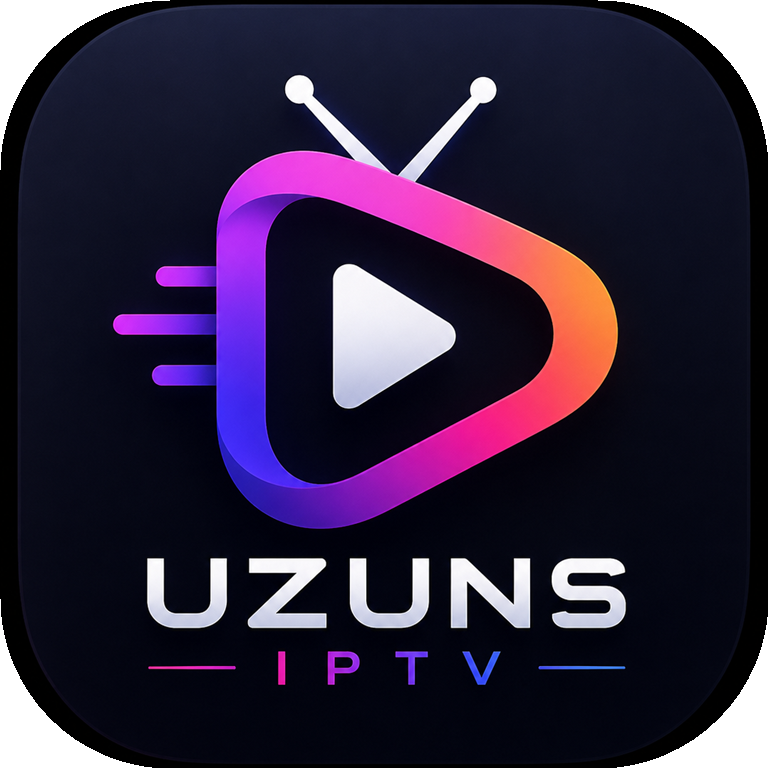

# UzunsIPTV 2.0

<p align="center">
  
</p>

<p align="center">
  Telefon, tablet ve Android TV için geliştirilmiş modern bir IPTV oynatıcısı.
</p>

<p align="center">
  
  
  
  
</p>

UzunsIPTV; Xtream Codes hesaplarını ve M3U oynatma listelerini tek bir arayüzde buluşturur. Canlı yayınları, filmleri ve dizileri telefon veya televizyon üzerinden rahatça keşfetmek ve izlemek için tasarlanmıştır.

<p align="center">
  <a href="https://github.com/OmerUzunsoy/UzunsIPTV/releases">Sürümleri ve APK dosyalarını görüntüle</a>
</p>

> UzunsIPTV herhangi bir kanal, yayın veya oynatma listesi sağlamaz. Uygulamayı kullanmak için size ait yasal bir Xtream Codes hesabı ya da M3U kaynağı gerekir.

## Öne çıkan özellikler

### Canlı TV

- Xtream Codes API ve M3U desteği
- Kategori bazlı kanal gezintisi
- Favoriler ve son izlenenler
- Telefon için yatay kaydırılabilir kategori şeritleri
- TV kumandası ve kanal numarası kısayolları
- Kanal logosu ve yayın bilgisi gösterimi

### Film ve dizi

- Kategori ve arama desteği
- Film ve dizi detay sayfaları
- Sezon ve bölüm seçimi
- İzleme ilerlemesini cihazda saklama
- Kaldığın yerden devam etme
- Sınırsız **Şansını Dene** önerileri
- YouTube fragman desteği

### Oynatıcı

- ExoPlayer tabanlı video oynatma
- Çoklu ses ve altyazı seçimi
- Oynatma hızı kontrolü
- Görüntü oranı seçenekleri
- Otomatik sonraki bölüm
- Canlı TV kanal paneli
- Kumanda renk tuşları ve sayı kısayolları

### Hesaplar ve profiller

- Birden fazla Xtream veya M3U hesabı saklama
- Netflix tarzı profil seçme ekranı
- Hazır profil renkleri
- Tek dokunuşla aktif profil değiştirme
- Hesap bilgilerinin cihazda güvenli biçimde saklanması

## 2.0 ile neler değişti?

UzunsIPTV 2.0 yalnızca bir renk güncellemesi değildir. Telefon ve TV deneyimi yeniden ele alınmıştır.

- Dikey telefonlar için özel kaynak seçimi, giriş ve ana ekran düzenleri
- Yatay telefonlarda daha ferah kartlar ve kompakt navigasyon
- Yenilenen koyu grafit tasarım sistemi
- Daha büyük dokunma alanları ve okunabilir metinler
- Telefon için yeniden tasarlanan film ve dizi detayları
- Kompakt, yatay kategori seçimi
- Yenilenen hesap ve profil yönetimi
- Cihazdan doğrudan M3U dosyası seçme
- Form doğrulama ve açıklayıcı hata mesajları
- Yeni uygulama ve launcher logosu
- Tek, tutarlı tema

## Desteklenen cihazlar

| Özellik | Değer |
|---|---|
| Minimum Android | Android 7.0 / API 24 |
| Hedef Android | Android 14 / API 34 |
| Compile SDK | API 36 |
| Telefon | Dikey ve yatay |
| Tablet | Desteklenir |
| Android TV | Leanback launcher ve kumanda desteği |

## Kullanım

### Xtream Codes hesabı ekleme

1. Uygulamayı açın.
2. **Xtream Codes** kartını seçin.
3. Sunucu adresini, kullanıcı adını ve şifreyi girin.
4. İsterseniz hesabınıza hatırlanabilir bir profil adı verin.
5. **Giriş Yap** düğmesine dokunun.

### M3U listesi ekleme

1. Ana ekrandan **M3U Playlist** seçeneğini açın.
2. Oynatma listesi adını ve URL adresini girin.
3. Alternatif olarak **Cihazdan M3U Dosyası Seç** düğmesini kullanın.
4. Playlist kaydedildiğinde Canlı TV ekranından kanallara erişebilirsiniz.

## Projeyi çalıştırma

### Gereksinimler

- Android Studio
- JDK 17 veya üzeri
- Android SDK 36

### Kurulum

```bash
git clone https://github.com/OmerUzunsoy/UzunsIPTV.git
cd UzunsIPTV
```

Projeyi Android Studio ile açın, Gradle eşitlemesinin tamamlanmasını bekleyin ve bir Android cihaz ya da emülatör seçerek çalıştırın.

Komut satırından debug APK oluşturmak için:

```bash
./gradlew assembleDebug
```

Windows üzerinde:

```powershell
.\gradlew.bat assembleDebug
```

Oluşturulan APK:

```text
app/build/outputs/apk/debug/app-debug.apk
```

## Test ve kalite kontrolü

```bash
./gradlew testDebugUnitTest lintDebug
```

Projede API istemcisi, kanal kısayolları ve temel uygulama davranışları için birim testleri bulunmaktadır.

## Kullanılan teknolojiler

| Teknoloji | Kullanım alanı |
|---|---|
| Kotlin | Uygulama geliştirme |
| Android Views | Responsive arayüzler |
| ExoPlayer | Video oynatma |
| Retrofit ve Gson | Xtream API iletişimi |
| Room | Favoriler ve izleme ilerlemesi |
| Glide | Poster ve kanal görselleri |
| Coroutines | Asenkron işlemler |
| Security Crypto | Yerel hesap verileri |

## Proje yapısı

```text
app/src/main/
├── java/com/uzuns/uzunsiptv/
│   ├── *Activity.kt          Ekranlar ve oynatıcı
│   ├── *Adapter.kt           Liste ve profil bileşenleri
│   ├── ApiClient.kt          Ağ istemcisi
│   ├── AccountsStore.kt      Hesap yönetimi
│   ├── M3uRepository.kt      M3U okuma ve önbellekleme
│   └── data/db/              Room veritabanı
└── res/
    ├── layout/               TV ve geniş ekran düzenleri
    ├── layout-port/          Dikey telefon düzenleri
    ├── drawable/             Arayüz ve marka kaynakları
    └── values/               Renkler, temalar ve metinler
```

## Katkıda bulunma

1. Depoyu fork edin.
2. Değişikliğiniz için yeni bir branch oluşturun.
3. Kodunuzu ekleyin ve testleri çalıştırın.
4. Açıklayıcı bir commit oluşturun.
5. Pull request açın.

Hata bildirirken cihaz modelini, Android sürümünü, ekran yönünü ve mümkünse ekran görüntüsünü eklemeniz sorunun daha hızlı çözülmesine yardımcı olur.

## Yasal bilgilendirme

Bu proje yalnızca medya oynatıcı işlevi sunar. Herhangi bir IPTV hizmeti, kanal paketi veya telifli içerik dağıtmaz. Kullanıcılar ekledikleri kaynakların kullanım ve yayın haklarından kendileri sorumludur.

## Geliştirici

**Ömer Uzunsoy**<br>
GitHub: [@OmerUzunsoy](https://github.com/OmerUzunsoy)

---

Projeyi faydalı bulduysanız GitHub üzerinden yıldız vererek destek olabilirsiniz.
